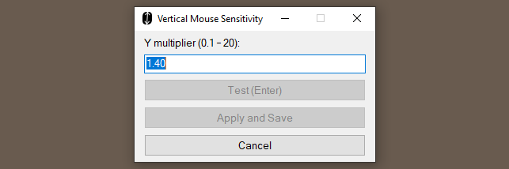
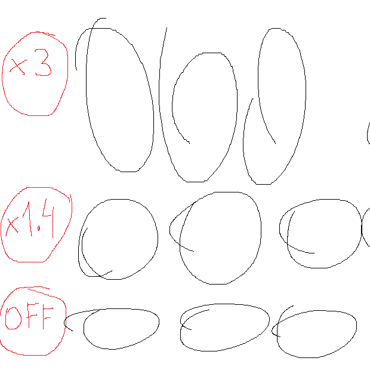

# Vertical Mouse Sensitivity

Adjust vertical (Y-axis) mouse sensitivity independently from horizontal movement on Windows.  
When enabled, vertical movement is scaled by `yMultiplier`, while horizontal movement remains unchanged.
Uses raw input (`WM_INPUT`) for sub-pixel precision at slow speeds.  
Built with AutoHotkey v2. 

## Install

1. Download the latest [`vertical-sens-v*.zip`](https://github.com/yakunins/vertical-mouse-sensitivity/releases/latest) from Releases
2. Extract files into a permanent folder (e.g. `C:\vertical-sens\`)
3. Run `install.cmd` — creates a startup shortcut, so the app launches after Windows logon

## Usage

- **`Win+Alt+V`** toggle on/off
- **System tray icon** shows current state; click to open the menu
- **Y Multiplier** can be changed via tray menu with test/apply/save

## How to Find the Right Value

To find a good vertical multiplier for your needs, open Paint (or any drawing program) and try drawing circles:  

## Configure

Edit `config.json` and restart the app, or change Y Multiplier via tray menu.

| Setting          | Default | Description                                                     |
| ---------------- | ------- | --------------------------------------------------------------- |
| `yMultiplier`    | `1.40`  | Vertical sensitivity multiplier (e.g. `2` = 2x vertical speed) |
| `toggleShortcut` | `"#!v"` | [AHK hotkey notation](https://www.autohotkey.com/docs/v2/Hotkeys.htm) to toggle on/off (`#!v` = Win+Alt+V)                 |
| `disableForExe`  | `[]`    | List of executable names to disable adjustment for (e.g. ["photoshop.exe"]) |
| `disableInGames` | `false` | Automatically disable for common games (CS2, Valorant, Fortnite, etc.). Most games have their own vertical sensitivity settings. |
| `disableOnDrag`  | `false`  | Disable adjustment while any mouse button is held (helps prevent issues in programs like Adobe Photoshop) |

## License
MIT

Enjoy!  
A donut, [maybe](https://www.paypal.com/donate/?business=KXM47EKBXFV4S&no_recurring=0&item_name=funding+of+github.com%2Fyakunins&currency_code=USD)? 🍩
